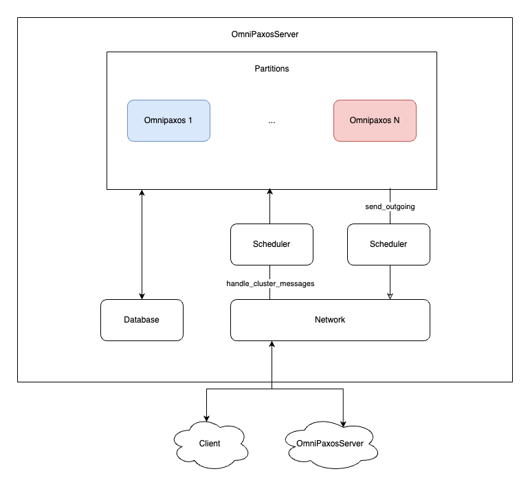
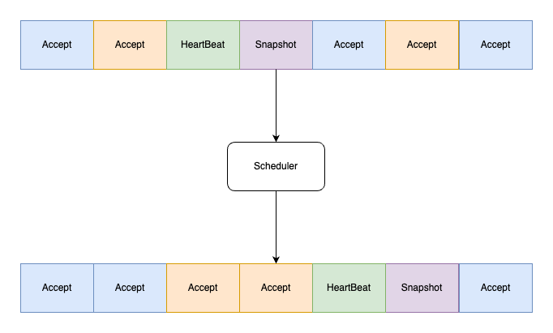

# eccos - Efficient Cross COnsensus Scheduling
This repository is a fork of the [omnipaxos-kv](https://github.com/haraldng/omnipaxos-kv) repo. Your task is to implement new scheduling strategies to fulfill the requirements mentioned in the project description:

- A scheduling algorithm which maximizes overall throughput, i.e., maximizes the sum of decided entries across all partitions.
- A scheduling algorithm that optimizes for fairness across the partitions, i.e., the number of decided entries per partition should be similar (small stddev).
- A scheduling algorithm which maximizes the throughput for specific partitions.

For bonus points you are required to perform the micro-profiling described in the project description.

A good starting point is to look at the [scheduler](https://github.com/EugenPark/omnipaxos-kv/blob/partition/src/server/scheduler.rs) and the [incoming](https://github.com/EugenPark/omnipaxos-kv/blob/partition/src/server/server.rs#L266) and [outgoing](https://github.com/EugenPark/omnipaxos-kv/blob/partition/src/server/server.rs#L140) scheduling points.

# Prerequisites
 - [Rust](https://www.rust-lang.org/tools/install)

# High-Level architecture

The main "brain" of the server is the `OmniPaxosServer` which coordinates the Omnipaxos partitions, network and database and has a main `run` function which handles all the important messages.
We can schedule the messages whenever we handle cluster messages (incoming messages) or whenever we send out messages to the network (outgoing messages).

The scheduler simply receives the message buffer and has outputs the reordered message buffer. Be vary of not letting the scheduler become the bottleneck and get creative with different scheduling approaches, such as
classic scheduling strategies (fifo, lifo, etc...) and parrallel-SMR approaches (keywords: "early scheduling" and "late scheduling").

# How to run
The `build_scripts` directory contains various utilities for configuring and running AutoQuorum clients and servers. Also contains examples of TOML file configuration. For local deployment you can use:
 - `run-local-client.sh` runs two clients in separate local processes. Configuration such as which server to connect to defined in TOML files.
 - `run-local-cluster.sh` runs a server cluster of size three in separate local processes.
 - `server-*-config.toml` configure each server
 - `client-*-config.toml` configure each client

Find a number of partitions that suit you by slowly increasing or decreasing the number of partitions in the config files.
